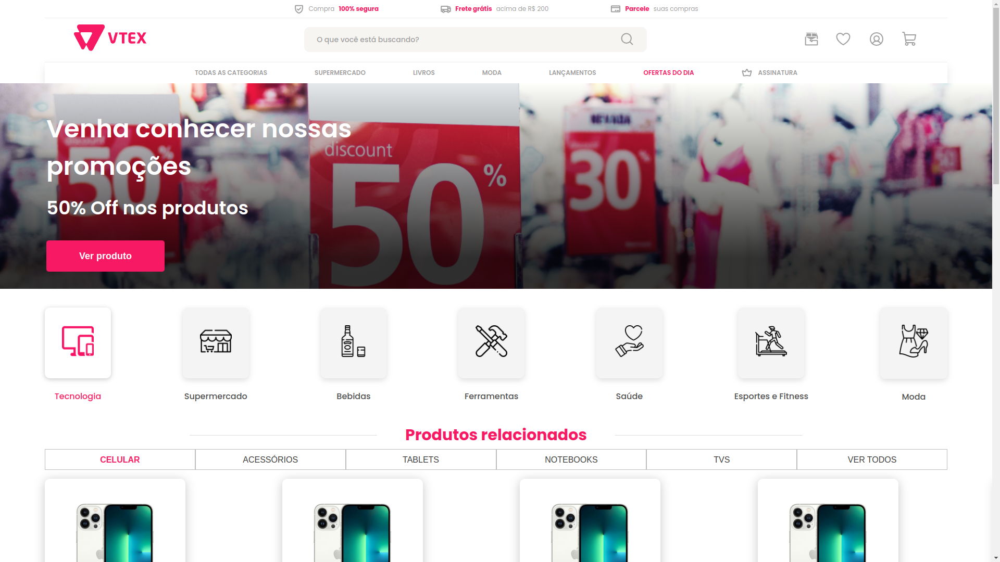

<h1 align="center">
  
</h1>

<p align="center">
  
  
</p>

# :computer: Tecnologias

- [React](https://react.dev/)
- [Sass](https://sass-lang.com)
- [Axios](https://axios-http.com/docs/intro)
- [Swiper](https://swiperjs.com)

<br />



<br />

# :construction_worker: Executando

```bash
## Clonar o repositório

git clone git@github.com:martinsgabriel1956/teste-front-end-jr.git

# ou

git clone https://github.com/martinsgabriel1956/teste-front-end-jr.git

## Instale as dependências

npm i/install

# ou

yarn

## Execute o projeto

npm run dev

# ou

yarn dev

```
